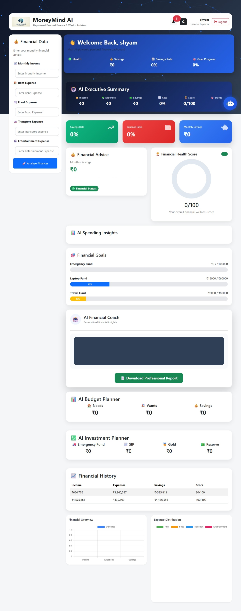
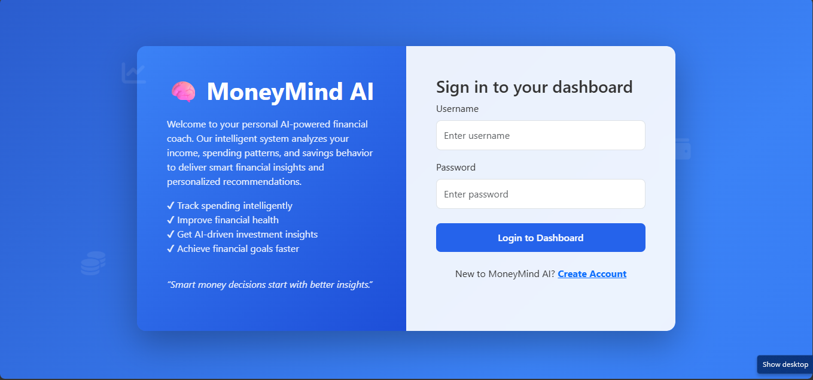
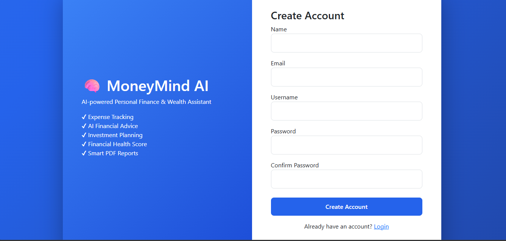

  

<h1 align="center"> MoneyMind AI</h1>

AI-powered Personal Finance & Wealth Assistant

### AI-powered Personal Finance & Wealth Assistant

MoneyMind AI is an intelligent financial planning web application that helps users analyze income, expenses, savings, and financial health through AI-driven insights and personalized recommendations.

---

## 🚀 Features

### 🔐 Authentication System

* User Registration
* Secure Login
* Password Hashing
* Session Management
* Multi-user Support

### 💰 Financial Analysis

* Income & Expense Tracking
* Savings Calculation
* Financial Health Score
* Expense Distribution Analysis
* Financial History Tracking

### 🤖 AI Insights

* Personalized Financial Advice
* AI-generated Recommendations
* Risk Analysis
* Investment Suggestions

### 📊 Investment Planner

* SIP Planning
* Emergency Fund Allocation
* Gold Investment Suggestions
* Savings Recommendations

### 📄 PDF Report Generator

* Professional Financial Reports
* Downloadable PDF Summary
* Investment Plan Included
* AI Recommendations Included

### 📈 Data Visualization

* Interactive Charts
* Expense Breakdown
* Financial Overview Dashboard
* Goal Progress Tracking

---

## 🛠 Tech Stack

### Backend

* Flask
* Python
* SQLite

### Frontend

* HTML5
* CSS3
* Bootstrap 5
* JavaScript

### AI Integration

* Groq API
* Llama Models

### Reporting

* ReportLab PDF Generator

---

## 📂 Project Structure

MoneyMind-AI/

├── app.py

├── .gitignore

├── static/

│ ├── logo.png

├── templates/

│ ├── login.html

│ ├── register.html

│ └── index.html

└── README.md

---

## ⚡ Installation

1. Clone the repository

git clone YOUR_REPOSITORY_LINK

2. Install dependencies

pip install -r requirements.txt

3. Create .env file

GROQ_API_KEY=your_api_key_here

4. Run the application

python app.py

---

## 🎯 Future Enhancements

* Admin Dashboard
* Email Verification
* Password Reset
* Financial Goal Tracking
* Cloud Database Integration
* Deployment on Render/Railway
* Mobile Responsive Design Improvements

---

## 👨‍💻 Developer

Shivam Yadav

B.Tech Computer Science

Cloud Computing Enthusiast | Full Stack Learner

---

⭐ If you like this project, give it a star.

## 📸 Project Screenshots

### Dashboard

### Login Page

### PDF Report

### Registration Page
